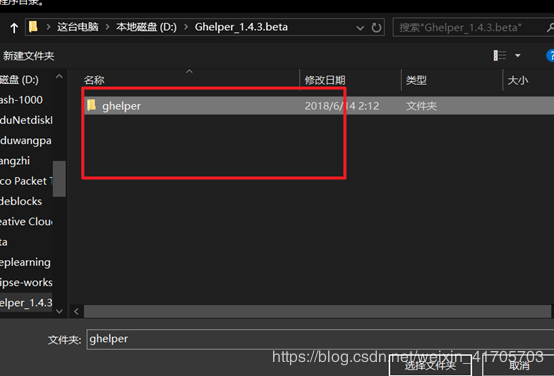

# Ghelper  google插件梯子，这么好用的梯子竟然没人用

先放一个压缩包，下载后解压即可

：

链接：https://pan.baidu.com/s/1X3zEFtVaOdiUtVr8qN_0ZQ

提取码：txb7

进入后打开开发者模式

然后加载已解压的扩展程序，将上面的的压缩包解压，直接选择ghelper文件夹，加载成功：

然后将按钮打开

按钮打开后：点击扩展按钮，注册一个账号就行了，亲测好用，用了两年了

注册账号后，你会发现google账号（建议注册一个google账号），google应用商城都可以用了。使用的前三天我记得是yuotube也是可以用了，三天过后就要买了，但是其他网站（google所有的网站，以及其他不敏感的网站）还是能用的，对于经常搜索技术文档和开源网站的我来说，不花钱也够用了，简直神器！！！
